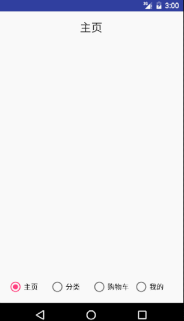

# Fragment加RadioGroup实现Tab导航

> 使用Fragment和RadioGroup实现Tab导航

效果图：


## 四个Fragment

### 首页

#### HomeFragment

```java
import android.os.Bundle;
import android.support.annotation.Nullable;
import android.support.v4.app.Fragment;
import android.view.LayoutInflater;
import android.view.View;
import android.view.ViewGroup;

/**
 * Created by Kevin on 2016/9/14.
 */
public class HomeFragment extends Fragment{
    @Nullable
    @Override
    public View onCreateView(LayoutInflater inflater, @Nullable ViewGroup container, @Nullable Bundle savedInstanceState) {
        View view = inflater.inflate(R.layout.fragment_home, null);
        return view;
    }
}
```

#### fragment_home.xml

```xml
<?xml version="1.0" encoding="utf-8"?>
<LinearLayout xmlns:android="http://schemas.android.com/apk/res/android"
    android:orientation="vertical" android:layout_width="match_parent"
    android:layout_height="match_parent">

    <TextView
        android:layout_width="wrap_content"
        android:layout_height="wrap_content"
        android:textAppearance="?android:attr/textAppearanceLarge"
        android:text="主页"
        android:id="@+id/textView"
        android:layout_gravity="center_horizontal" />
</LinearLayout>
```


### 分类

#### TypeFragment

```java
import android.os.Bundle;
import android.support.annotation.Nullable;
import android.support.v4.app.Fragment;
import android.view.LayoutInflater;
import android.view.View;
import android.view.ViewGroup;

/**
 * Created by Kevin on 2016/9/14.
 */
public class TypeFragment extends Fragment{
    @Nullable
    @Override
    public View onCreateView(LayoutInflater inflater, @Nullable ViewGroup container, @Nullable Bundle savedInstanceState) {
        View view = inflater.inflate(R.layout.fragment_type, null);
        return view;
    }
}
```

#### fragment_type.xml

```xml
<?xml version="1.0" encoding="utf-8"?>
<LinearLayout xmlns:android="http://schemas.android.com/apk/res/android"
    android:orientation="vertical" android:layout_width="match_parent"
    android:layout_height="match_parent">

    <TextView
        android:layout_width="wrap_content"
        android:layout_height="wrap_content"
        android:textAppearance="?android:attr/textAppearanceLarge"
        android:text="分类"
        android:id="@+id/textView"
        android:layout_gravity="center_horizontal" />
</LinearLayout>
```


### 购物车

#### CartFragment

```java
import android.os.Bundle;
import android.support.annotation.Nullable;
import android.support.v4.app.Fragment;
import android.view.LayoutInflater;
import android.view.View;
import android.view.ViewGroup;

/**
 * Created by Kevin on 2016/9/14.
 */
public class CartFragment extends Fragment {
    @Nullable
    @Override
    public View onCreateView(LayoutInflater inflater, @Nullable ViewGroup container, @Nullable Bundle savedInstanceState) {
        View view = inflater.inflate(R.layout.fragment_cart, null);
        return view;
    }
}
```

#### fragment_cart.xml

```xml
<?xml version="1.0" encoding="utf-8"?>
<LinearLayout xmlns:android="http://schemas.android.com/apk/res/android"
    android:orientation="vertical" android:layout_width="match_parent"
    android:layout_height="match_parent">

    <TextView
        android:layout_width="wrap_content"
        android:layout_height="wrap_content"
        android:textAppearance="?android:attr/textAppearanceLarge"
        android:text="购物车"
        android:id="@+id/textView"
        android:layout_gravity="center_horizontal" />
</LinearLayout>
```


### 我的

#### MineFragment

```java
import android.os.Bundle;
import android.support.annotation.Nullable;
import android.support.v4.app.Fragment;
import android.view.LayoutInflater;
import android.view.View;
import android.view.ViewGroup;

/**
 * Created by Kevin on 2016/9/14.
 */
public class MineFragment extends Fragment{
    @Nullable
    @Override
    public View onCreateView(LayoutInflater inflater, @Nullable ViewGroup container, @Nullable Bundle savedInstanceState) {
        View view = inflater.inflate(R.layout.fragment_mine, null);
        return view;
    }
}
```

#### fragment_mine.xml

```xml
<?xml version="1.0" encoding="utf-8"?>
<LinearLayout xmlns:android="http://schemas.android.com/apk/res/android"
    android:orientation="vertical" android:layout_width="match_parent"
    android:layout_height="match_parent">

    <TextView
        android:layout_width="wrap_content"
        android:layout_height="wrap_content"
        android:textAppearance="?android:attr/textAppearanceLarge"
        android:text="我的"
        android:id="@+id/textView"
        android:layout_gravity="center_horizontal" />
</LinearLayout>
```


## 主界面

### TabActivity

```java
import android.os.Bundle;
import android.support.v4.app.Fragment;
import android.support.v4.app.FragmentActivity;
import android.view.KeyEvent;
import android.widget.RadioButton;
import android.widget.RadioGroup;

import com.oracleoaec.mall.R;
import com.oracleoaec.mall.adapter.FragmentTabAdapter;
import com.oracleoaec.mall.fragment.CartFragment;
import com.oracleoaec.mall.fragment.HomeFragment;
import com.oracleoaec.mall.fragment.MineFragment;
import com.oracleoaec.mall.fragment.TypeFragment;

import java.util.ArrayList;
import java.util.List;

public class TabActivity extends FragmentActivity {
	/**
	 * Called when the activity is first created.
	 */
	RadioButton radioButton1, radioButton2, radioButton3, radioButton4;
	private RadioGroup rgs;
	public List<Fragment> fragments = new ArrayList<Fragment>();
	FragmentTabAdapter tabAdapter;
	HomeFragment tab1;
	TypeFragment tab2;
	CartFragment tab3;
	MineFragment tab4;

	@Override
	public void onCreate(Bundle savedInstanceState) {
		super.onCreate(savedInstanceState);
		setContentView(R.layout.activity_tab);
		tab1 = new HomeFragment();
		tab2 = new TypeFragment();
		tab3 = new CartFragment();
		tab4 = new MineFragment();
		fragments.add(tab1);
		fragments.add(tab2);
		fragments.add(tab3);
		fragments.add(tab4);
		radioButton1 = (RadioButton) findViewById(R.id.rb_home);
		radioButton2 = (RadioButton) findViewById(R.id.rb_type);
		radioButton3 = (RadioButton) findViewById(R.id.rb_cart);
		radioButton4 = (RadioButton) findViewById(R.id.rb_mine);
		rgs = (RadioGroup) findViewById(R.id.rg_tab);
         rgs.check(R.id.rb_home);//默认选中第一个按钮
		tabAdapter = new FragmentTabAdapter(this, fragments, R.id.frame,
				rgs);
		tabAdapter.setOnRgsExtraCheckedChangedListener(new FragmentTabAdapter.OnRgsExtraCheckedChangedListener(){
            @Override
            public void OnRgsExtraCheckedChanged(RadioGroup radioGroup, int checkedId, int index) {
                super.OnRgsExtraCheckedChanged(radioGroup, checkedId, index);
            }
        });

	}

	@Override
	// 设置回退
	// 覆盖Activity类的onKeyDown(int keyCoder,KeyEvent event)方法
	public boolean onKeyDown(int keyCode, KeyEvent event) {
		if ((keyCode == KeyEvent.KEYCODE_BACK)) {
			if(tabAdapter.getCurrentTab()!=0){
				radioButton1.setChecked(true);
				return true;
			}
		}
		return super.onKeyDown(keyCode, event);
	}

}
```

### activity_tab.xml

```java
<?xml version="1.0" encoding="utf-8"?>
<LinearLayout xmlns:android="http://schemas.android.com/apk/res/android"
    xmlns:tools="http://schemas.android.com/tools"
    android:layout_width="match_parent"
    android:layout_height="match_parent"
    android:orientation="vertical"
    tools:context=".activity.MainActivity">

    <FrameLayout
        android:id="@+id/frame"
        android:layout_width="match_parent"
        android:layout_height="0dp"
        android:layout_weight="1">

    </FrameLayout>

    <RadioGroup
        android:id="@+id/rg_tab"
        android:layout_width="match_parent"
        android:layout_height="50dp"
        android:background="#dcdcdc"
        android:layout_marginBottom="2dp"
        android:layout_marginTop="2dp"
        android:orientation="horizontal">

        <RadioButton
            android:id="@+id/rb_home"
            android:layout_width="0dp"
            android:layout_height="wrap_content"
            android:layout_weight="1"
            android:button="@null"
            android:background="@drawable/sel_tab_home"/>

        <RadioButton
            android:id="@+id/rb_type"
            android:layout_width="0dp"
            android:layout_height="wrap_content"
            android:layout_weight="1"
            android:button="@null"
            android:background="@drawable/sel_tab_type" />

        <RadioButton
            android:id="@+id/rb_cart"
            android:layout_width="0dp"
            android:layout_height="wrap_content"
            android:layout_weight="1"
            android:button="@null"
            android:background="@drawable/sel_tab_cart"/>

        <RadioButton
            android:id="@+id/rb_mine"
            android:layout_width="0dp"
            android:layout_height="wrap_content"
            android:layout_weight="1"
            android:button="@null"
            android:background="@drawable/sel_tab_mine"/>
    </RadioGroup>
</LinearLayout>
```

## Fragment适配器

FragmentTabAdapter

```java
import android.support.v4.app.Fragment;
import android.support.v4.app.FragmentActivity;
import android.support.v4.app.FragmentTransaction;
import android.widget.RadioGroup;

import com.oracleoaec.mall.R;

import java.util.List;

public class FragmentTabAdapter implements RadioGroup.OnCheckedChangeListener {
	private List<Fragment> fragments; // 一个tab页面对应一个Fragment
	private RadioGroup rgs; // 用于切换tab
	private FragmentActivity fragmentActivity; // Fragment所属的Activity
	private int fragmentContentId; // Activity中所要被替换的区域的id

	private int currentTab; // 当前Tab页面索引

	private OnRgsExtraCheckedChangedListener onRgsExtraCheckedChangedListener; // 用于让调用者在切换tab时候增加新的功能

	public FragmentTabAdapter(FragmentActivity fragmentActivity,
			List<Fragment> fragments, int fragmentContentId, RadioGroup rgs) {
		this.fragments = fragments;
		this.rgs = rgs;
		this.fragmentActivity = fragmentActivity;
		this.fragmentContentId = fragmentContentId;

		// 默认显示第一页
		FragmentTransaction ft = fragmentActivity.getSupportFragmentManager()
				.beginTransaction();
		ft.add(fragmentContentId, fragments.get(0));
		ft.commitAllowingStateLoss();

		rgs.setOnCheckedChangeListener(this);

	}

	@Override
	public void onCheckedChanged(RadioGroup radioGroup, int checkedId) {
		for (int i = 0; i < rgs.getChildCount(); i++) {
			if (rgs.getChildAt(i).getId() == checkedId) {
				selectTab(i);
			}
		}

	}

	/**
	 * 切换tab
	 * 
	 * @param idx
	 */
	private void showTab(int idx) {
		for (int i = 0; i < fragments.size(); i++) {
			Fragment fragment = fragments.get(i);
			FragmentTransaction ft = obtainFragmentTransaction(idx);

			if (idx == i) {
				ft.show(fragment);
			} else {
				ft.hide(fragment);
			}
			ft.commitAllowingStateLoss();
		}
		currentTab = idx; // 更新目标tab为当前tab
	}

	/**
	 * 获取一个带动画的FragmentTransaction
	 *
	 * @param index
	 * @return
	 */
	private FragmentTransaction obtainFragmentTransaction(int index) {
		FragmentTransaction ft = fragmentActivity.getSupportFragmentManager()
				.beginTransaction();
		// 设置切换动画
		if (index > currentTab) {
			ft.setCustomAnimations(R.anim.slide_left_in, R.anim.slide_left_out);
		} else {
			ft.setCustomAnimations(R.anim.slide_right_in,
					R.anim.slide_right_out);
		}
		return ft;
	}

	public int getCurrentTab() {
		return currentTab;
	}

	public Fragment getCurrentFragment() {
		return fragments.get(currentTab);
	}

	public OnRgsExtraCheckedChangedListener getOnRgsExtraCheckedChangedListener() {
		return onRgsExtraCheckedChangedListener;
	}

	public void setOnRgsExtraCheckedChangedListener(
			OnRgsExtraCheckedChangedListener onRgsExtraCheckedChangedListener) {
		this.onRgsExtraCheckedChangedListener = onRgsExtraCheckedChangedListener;
	}

	/**
	 * 切换tab额外功能功能接口
	 */
	public static class OnRgsExtraCheckedChangedListener {
		public void OnRgsExtraCheckedChanged(RadioGroup radioGroup,
				int checkedId, int index) {

		}
	}

	public void selectTab(int i) {

		Fragment fragment = fragments.get(i);
		FragmentTransaction ft = obtainFragmentTransaction(i);

		getCurrentFragment().onPause(); // 暂停当前tab
		// getCurrentFragment().onStop(); // 暂停当前tab

		if (fragment.isAdded()) {
			// fragment.onStart(); // 启动目标tab的onStart()
			fragment.onResume(); // 启动目标tab的onResume()
		} else {
			ft.add(fragmentContentId, fragment);
		}
		showTab(i); // 显示目标tab
		ft.commitAllowingStateLoss();

		// 如果设置了切换tab额外功能功能接口
		if (null != onRgsExtraCheckedChangedListener) {
			// onRgsExtraCheckedChangedListener.OnRgsExtraCheckedChanged(
			// radioGroup, checkedId, i);
		}

	}
}
```

## 动画

在res下新建一个目录，叫做anim

### slide_left_in.xml

```xml
<?xml version="1.0" encoding="utf-8"?>
<set xmlns:android="http://schemas.android.com/apk/res/android">
    <translate
        android:duration="200"
        android:fromXDelta="100%p"
        android:toXDelta="0" />
</set>
```

### slide_left_out.xml

```xml
<?xml version="1.0" encoding="utf-8"?>
<set xmlns:android="http://schemas.android.com/apk/res/android">
    <translate
        android:duration="200"
        android:fromXDelta="0"
        android:toXDelta="-100%p" />
</set>
```

### slide_right_in.xml

```xml
<?xml version="1.0" encoding="utf-8"?>
<set xmlns:android="http://schemas.android.com/apk/res/android">
    <translate
        android:duration="200"
        android:fromXDelta="-100%p"
        android:toXDelta="0" />
</set>
```

### slide_right_out.xml

```xml
<?xml version="1.0" encoding="utf-8"?>
<set xmlns:android="http://schemas.android.com/apk/res/android" >
    <translate
        android:duration="200"
        android:fromXDelta="0"
        android:toXDelta="100%p" />
</set>
```