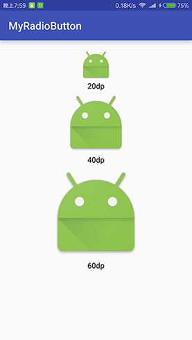

# 自定义RadioButton

> 自定义RadioButton，可以在布局文件通过属性设置drawableTop、drawableBottom、drawableRight、drawableLeft图片的宽高

## 效果图



## 代码

### MyRadioButton.java

```java
package com.oaec.myradiobutton;

import android.content.Context;
import android.content.res.TypedArray;
import android.graphics.drawable.Drawable;
import android.util.AttributeSet;
import android.widget.RadioButton;

/**
 * Created by Kevin on 2016/9/14.
 */
public class MyRadioButton extends RadioButton {

    // 申明上下左右对应的图片
    private Drawable drawableTop, drawableBottom, drawableLeft, drawableRight;
    // 上下左右图片对应长和宽
    private int mTopWidth, mTopHeight, mBottomWidth, mBottomHeight, mRightWidth, mRightHeight, mLeftWidth, mLeftHeight;

    public MyRadioButton(Context context) {
        super(context);
        initView(context, null);
    }

    public MyRadioButton(Context context, AttributeSet attrs) {
        super(context, attrs);
        initView(context, attrs);
    }

    public MyRadioButton(Context context, AttributeSet attrs, int defStyleAttr) {
        super(context, attrs, defStyleAttr);
        initView(context, attrs);
    }

    private void initView(Context context, AttributeSet attrs) {
        if (attrs != null) {
            float scale = context.getResources().getDisplayMetrics().density;
            TypedArray a = context.obtainStyledAttributes(attrs, R.styleable.MyRadioButton);
            int n = a.getIndexCount();
            for (int i = 0; i < n; i++) {
                int attr = a.getIndex(i);
                switch (attr) {
                    case R.styleable.MyRadioButton_drawableBottom:
                        drawableBottom = a.getDrawable(attr);
                        break;
                    case R.styleable.MyRadioButton_drawableTop:
                        drawableTop = a.getDrawable(attr);
                        break;
                    case R.styleable.MyRadioButton_drawableLeft:
                        drawableLeft = a.getDrawable(attr);
                        break;
                    case R.styleable.MyRadioButton_drawableRight:
                        drawableRight = a.getDrawable(attr);
                        break;
                    case R.styleable.MyRadioButton_drawableTopWidth:
                        mTopWidth = (int) (a.getDimension(attr, 20) * scale + 0.5f);
                        break;
                    case R.styleable.MyRadioButton_drawableTopHeight:
                        mTopHeight = (int) (a.getDimension(attr, 20) * scale + 0.5f);
                        break;
                    case R.styleable.MyRadioButton_drawableBottomWidth:
                        mBottomWidth = (int) (a.getDimension(attr, 20) * scale + 0.5f);
                        break;
                    case R.styleable.MyRadioButton_drawableBottomHeight:
                        mBottomHeight = (int) (a.getDimension(attr, 20) * scale + 0.5f);
                        break;
                    case R.styleable.MyRadioButton_drawableRightWidth:
                        mRightWidth = (int) (a.getDimension(attr, 20) * scale + 0.5f);
                        break;
                    case R.styleable.MyRadioButton_drawableRightHeight:
                        mRightHeight = (int) (a.getDimension(attr, 20) * scale + 0.5f);
                        break;
                    case R.styleable.MyRadioButton_drawableLeftWidth:
                        mLeftWidth = (int) (a.getDimension(attr, 20) * scale + 0.5f);
                        break;
                    case R.styleable.MyRadioButton_drawableLeftHeight:
                        mLeftHeight = (int) (a.getDimension(attr, 20) * scale + 0.5f);
                        break;

                    default:
                        break;
                }
            }
            a.recycle();
            setCompoundDrawablesWithIntrinsicBounds(drawableLeft, drawableTop, drawableRight, drawableBottom);
        }
    }
    // 设置Drawable定义的大小
    @Override
    public void setCompoundDrawablesWithIntrinsicBounds(Drawable left, Drawable top, Drawable right, Drawable bottom) {

        if (left != null) {
            left.setBounds(0, 0, mLeftWidth <= 0 ? left.getIntrinsicWidth() : mLeftWidth, mLeftHeight <= 0 ? left.getMinimumHeight() : mLeftHeight);
        }
        if (right != null) {
            right.setBounds(0, 0, mRightWidth <= 0 ? right.getIntrinsicWidth() : mRightWidth, mRightHeight <= 0 ? right.getMinimumHeight() : mRightHeight);
        }
        if (top != null) {
            top.setBounds(0, 0, mTopWidth <= 0 ? top.getIntrinsicWidth() : mTopWidth, mTopHeight <= 0 ? top.getMinimumHeight() : mTopHeight);
        }
        if (bottom != null) {
            bottom.setBounds(0, 0, mBottomWidth <= 0 ? bottom.getIntrinsicWidth() : mBottomWidth, mBottomHeight <= 0 ? bottom.getMinimumHeight()
                    : mBottomHeight);
        }
        setCompoundDrawables(left, top, right, bottom);
    }
}
```

### attrs.xml

```xml
<?xml version="1.0" encoding="utf-8"?>
<resources>
    <declare-styleable name="MyRadioButton">
        <!-- 设置top图片的宽度 -->
        <attr name="drawableTopWidth" format="dimension" />
        <!-- 设置top图片的高度 -->
        <attr name="drawableTopHeight" format="dimension" />
        <attr name="drawableBottomWidth" format="dimension" />
        <attr name="drawableBottomHeight" format="dimension" />
        <attr name="drawableRightWidth" format="dimension" />
        <attr name="drawableRightHeight" format="dimension" />
        <attr name="drawableLeftWidth" format="dimension" />
        <attr name="drawableLeftHeight" format="dimension" />
        <!-- 设置top的图片资源 -->
        <attr name="drawableTop" format="reference" />
        <attr name="drawableBottom" format="reference" />
        <attr name="drawableRight" format="reference" />
        <attr name="drawableLeft" format="reference" />
    </declare-styleable>
</resources>
```
## 在布局中使用

```xml
<com.oaec.myradiobutton.MyRadioButton
    android:layout_width="wrap_content"
    android:layout_height="wrap_content"
    android:button="@null"
    android:text="20dp"
    android:gravity="center_horizontal"
    app:drawableTop="@mipmap/ic_launcher"
    app:drawableTopWidth="20dp"
    app:drawableTopHeight="20dp"
    android:layout_centerHorizontal="true"
    android:id="@+id/view" />
```

