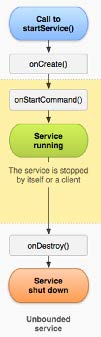
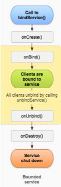

# 四大组件-Service

## 概述

### 定义

- 在后台运行，不可见，没有界面，优先级高于Activity

### 用途

- 播放音乐、记录地理位置变化等待

### 注意

- 运行在主线程，不能用它来做耗时操作
- 可以在服务中开一个线程，做耗时操作

## 分类

### 本地服务

在应用程序内部，通过start方式或bind方式启动，通过stop或unbind方式结束

### 远程服务

Android系统内部的应用程序之间

## 创建Service

### 步骤

**第一步：** 创建一个Class，继承自Service

**第二步：**在清单文件中注册Service

### 例子

```java
import android.app.Service;
import android.content.Intent;
import android.os.IBinder;
import android.support.annotation.Nullable;
import android.util.Log;

/**
 * Created by Kevin on 2016/9/19.
 * Description：
 */
public class MyStartService extends Service {
    private static final String TAG = "MyStartService";

    @Nullable
    @Override
    public IBinder onBind(Intent intent) {
        return null;
    }

    @Override
    public void onCreate() {
        super.onCreate();
        Log.d(TAG, "onCreate: ");
    }

    @Override
    public int onStartCommand(Intent intent, int flags, int startId) {
        Log.d(TAG, "onStartCommand: ");
        return super.onStartCommand(intent, flags, startId);
    }

    @Override
    public void onDestroy() {
        super.onDestroy();
        Log.d(TAG, "onDestroy: ");
    }
}
```

## 启动Service

启动Service分为两种方式，Start方式和Bind方式

### Start方法启动

#### 步骤

1. 实例化Intent对象

```java
  Intent intent = new Intent(this,MyStartService.class);
```

2. 启动服务

```java
  startService(intent);
```

3. 停止服务

```java
  stopService(intent);
```

#### 生命周期



#### 特点

- 服务和启动源没有任何关系
- 无法得到服务对象

### bind方式启动

#### 步骤

#### 生命周期



#### 特点

- 通过IBinder接口实例，返回一个ServiceConnection对象给启动源
- 通过ServiceConnection对象的相关方法可以得到Service对象

## 常见的系统服务

