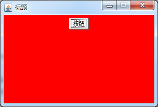
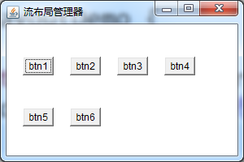
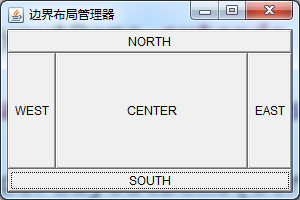
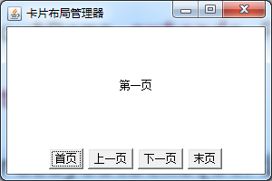
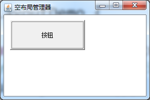
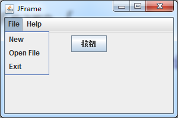

# GUI

[TOC]

## 概述

> GUI(Graphical User Interface)-图形化用户界面。用户和程序之间可以通过GUI能方便友好地进行交互。在Java语言中，JFC(Java Foundation Classed)是开发GUI的API集，它主要包含以下几个部分：

- AWT(抽象窗口工具包)：Java开发用户界面最初的工具包，是建立JFC的主要基础。
- Swing组件：建立在AWT之上，新的、功能更强大的图形组件包

## AWT框架

### Component类

- `Component`类是最核心的类,它是构成Java图形用户界面的基础，大部分组件都是由该类派生出来的。
- `Component`类主要由基本组件和容器`Container`组件组成。
- 容器`Container`组件主要分为：`Window`容器和`Panel`容器

### Frame容器和Panel容器

#### Frame容器

- Window是能独立存在的容器，它有一个子类Frame,它是一个带有标题和缩放角的窗口。
- Frame有一个构造方法`Frame(Stringtitle)`，可以设置标题
- 可以通过`add()`方法，在Frame容器中加入其他的组件。
- Frame容器有默认的布局管理器：`BorderLayout`。
- Frame被创建后，是不可见的，需要执行`setVisible(true)`设置可见

#### Panel容器

- Panel只能存在于其他的容器(Window或其子类)中才能显示出来。
- 通过Panel的默认构造方法Panel()可以创建一个Panel容器
- 容器不但能容纳组件，还能容纳其它容器，通过容器的嵌套可以制作出复杂的布局。

#### 例子

```java
class MyFrame extends Frame {

	private static final long serialVersionUID = 6338484641644928054L;

	public MyFrame(String title) {
		super(title);
		init();
	}

	private void init() {
		// 设置大小
		this.setSize(300, 200);
		this.setBackground(Color.BLUE);
		// 设置窗口居中
		this.setLocationRelativeTo(null);
		// 禁止重置大小
		this.setResizable(false);
		// 创建一个panel
		Panel panel = new Panel();
		// 设置panel背景色为红色
		panel.setBackground(Color.RED);
		// 将panel容器添加到frame容器
		this.add(panel);
		// 创建一个button
		Button button = new Button("按钮");
		// 将button添加到panel容器
		panel.add(button);
		button.addActionListener(new ActionListener() {

			@Override
			public void actionPerformed(ActionEvent e) {
				// panel背景色在Red和Green中切换
				Color color = panel.getBackground();
				color = color.equals(Color.RED) ? Color.GREEN : Color.RED;
				panel.setBackground(color);
			}
		});
		// 设置可见性
		this.setVisible(true);
		// 关闭窗口
		this.addWindowListener(new WindowAdapter() {
			@Override
			public void windowClosing(WindowEvent e) {
				System.exit(0);
			}
		});
	}

}
```



### 布局管理器

#### 概述

> 容器内可以存放不同的组件，容器内组件的摆放位置和大小有容器的布局管理器决定，接下来讲解一下4个布局管理器：

- FlowLayout：流布局管理器
- BorderLayout：边框布局管理器
- GridLayout：网格布局管理器
- CardLayout：卡片布局管理器

##### 设置方法

```java
public void setLayout(LayoutManager mgr)
```

#### FlowLayout

​	按照指定的对齐方式顺序摆放组件，若空间不够，则换行

##### 构造方法

1. `FlowLayout()`：默认居中对齐
2. `FlowLayout(int align)`：指定对齐方式
3. `FlowLayout(int align, int hgap, int vgap)`：指定对齐方式，水平间距，垂直间距


##### 例子

```java
class FlowLayoutDemo extends Frame{

	private static final long serialVersionUID = -5581804027043150613L;
	
	public FlowLayoutDemo(String title) {
		super(title);
		init();
	}

	private void init() {
		//窗口大小
		this.setSize(300, 200);
		//居中
		this.setLocationRelativeTo(null);
		//设置布局管理器
		FlowLayout layout = new FlowLayout(FlowLayout.LEFT, 20, 40);
		this.setLayout(layout);
		//添加6个按钮
		this.add(new Button("btn1"));
		this.add(new Button("btn2"));
		this.add(new Button("btn3"));
		this.add(new Button("btn4"));
		this.add(new Button("btn5"));
		this.add(new Button("btn6"));
		//设置可见
		this.setVisible(true);
		this.addWindowListener(new WindowAdapter() {
			@Override
			public void windowClosing(WindowEvent e) {
				System.exit(0);
			}
		});
	}
	
}
```



#### BorderLayout

​	边界布局管理器，其中有东西南北中五个位置可以存放组件，分别对应：右、左、下、上、中

##### 构造方法

1. `BorderLayout()`：创建默认的边界布局管理器
2. `BorderLayout(int hgap, int vgap)`：设置水平间距和垂直间距

##### 例子

```java
class BorderLayoutDemo extends Frame {

	private static final long serialVersionUID = -5051442767384958495L;

	public BorderLayoutDemo(String title) {
		super(title);
		init();
	}

	private void init() {
		this.setSize(300, 200);
		this.setLocationRelativeTo(null);

		// 设置布局管理器
		BorderLayout layout = new BorderLayout();
		this.setLayout(layout);
		// 添加5个按钮
		this.add(new Button("SOUTH"), BorderLayout.SOUTH);
		this.add(new Button("NORTH"), BorderLayout.NORTH);
		this.add(new Button("WEST"), BorderLayout.WEST);
		this.add(new Button("EAST"), BorderLayout.EAST);
		this.add(new Button("CENTER"), BorderLayout.CENTER);

		this.setVisible(true);
		this.addWindowListener(new WindowAdapter() {
			@Override
			public void windowClosing(WindowEvent e) {
				System.exit(0);
			}
		});
	}
}
```



#### GridLayout

​	网格布局，将组件放在指定的行和列中，当空间不足时，会增加列数 

##### 构造方法

1. `GridLayout()`：创建一个默认的网格布局管理器
2. `GridLayout(int rows, int cols)`：创建一个指定行和列的网格布局管理器
3. `GridLayout(int rows, int cols, int hgap, int vgap)`：创建一个指定行和列、水平间距和垂直间距的网格布局管理器

##### 例子

```java
class GridLayoutDemo extends Frame {

	private static final long serialVersionUID = 9002920584900068024L;

	public GridLayoutDemo(String title) {
		super(title);
		init();
	}

	private void init() {
		this.setSize(300, 200);
		this.setLocationRelativeTo(null);

		// 设置布局管理器
		GridLayout layout = new GridLayout(3, 2);
		this.setLayout(layout);
		// 添加按钮
		this.add(new Button("btn_1"));
		this.add(new Button("btn_2"));
		this.add(new Button("btn_3"));
		this.add(new Button("btn_4"));
		this.add(new Button("btn_5"));

		this.setVisible(true);
		this.addWindowListener(new WindowAdapter() {
			@Override
			public void windowClosing(WindowEvent e) {
				System.exit(0);
			}
		});
	}
}
```


#### CardLayout

卡片布局，将组件或者容器当做一张张的卡片，可以控制显示第几张，默认只显示第一张

##### 构造方法

1. `CardLayout()`：创建默认的卡片布局管理器
2. `CardLayout(int hgap, int vgap)`：创建指定水平间距和垂直间距的卡片布局管理器

##### 例子

```java
class CardLayoutDemo extends Frame {

	private static final long serialVersionUID = 6906711312019695883L;

	public CardLayoutDemo(String title) {
		super(title);
		init();
	}

	private void init() {
		this.setSize(300, 200);
		this.setLocationRelativeTo(null);

		Panel panel_main = new Panel();
		Panel panel_btn = new Panel();
		// 设置卡片布局管理器
		CardLayout cardLayout = new CardLayout();
		panel_main.setLayout(cardLayout);
		// 添加4个label
		panel_main.add(new Label("第一页", Label.CENTER));
		panel_main.add(new Label("第二页", Label.CENTER));
		panel_main.add(new Label("第三页", Label.CENTER));
		panel_main.add(new Label("第四页", Label.CENTER));
		// Frame默认布局管理器：BorderLayout
		this.add(panel_main, BorderLayout.CENTER);
		this.add(panel_btn, BorderLayout.SOUTH);
		// panel默认的布局管理器：FlowLayout
		panel_btn.add(new Button("首页"));
		panel_btn.add(new Button("上一页"));
		panel_btn.add(new Button("下一页"));
		panel_btn.add(new Button("末页"));
		this.setVisible(true);
		this.addWindowListener(new WindowAdapter() {
			@Override
			public void windowClosing(WindowEvent e) {
				System.exit(0);
			}
		});
	}
}
```



#### 默认布局管理器

- 每个容器都有一个与他相关的缺省布局管理器
- Panel的默认布局管理器是FlowLayout
- Frame的默认布局管理器是BorderLayout

#### 空布局管理器

- 可以通过设置空布局管理器，来控制组件的大小和位置。`setLayout(null)`
- 在设置空布局管理器之后，必须对添加的组件调用`setLocation`、`setSize()`或者`setBounds()`，将他们定位到容器中

##### 例子

```java
class NullLayoutDemo extends Frame{

	private static final long serialVersionUID = 734382904336800601L;
	public NullLayoutDemo() {
		super("空布局管理器");
		init();
	}
	private void init() {
		this.setSize(300, 200);
		this.setLocationRelativeTo(null);
		this.setLayout(null);
		Button button = new Button("按钮");
		button.setBounds(20, 40, 150, 60);
		this.add(button);
		this.setVisible(true);
		this.addWindowListener(new WindowAdapter() {
			@Override
			public void windowClosing(WindowEvent e) {
				System.exit(0);
			}
		});
	}
}
```



### 事件模型

#### 基本概念

AWT的事件处理中，主要涉及3类对象：

1. **Event（事件）**：用户对组件的一个操作，称之为一个事件，以类的形式出现，例如，键盘操作对应的事件类是KeyEvent。其实例在该事件发生时有系统自动产生。每一种事件都对应专门的监听者
2. **Event Source（事件源）**：事件发生的场所，通常就是各个组件，例如按钮Button。
3. **Event Monitor（事件监听器）**：接收事件对象并对其进行处理的类的对象，通常其中某个成员方法对事件进行相应的处理。

#### 事件分类

AWT的相关事件继承于java.awt.AWTEvent类，这些事件分为两大类：低级事件和高级事件。

- **低级事件**：是指基于组件和容器的事件，当一个组件发生事件，如鼠标进入、点击、拖放或组件的窗口开关等时，触发了组件事件。

  | 事件名            | 说明                 |
  | -------------- | ------------------ |
  | ComponentEvent | 组件事件：组件尺寸的变化、移动    |
  | ContainerEvent | 容器事件：组件增加、移动       |
  | WindowEvent    | 窗口事件：关闭窗口、窗口闭合、图标化 |
  | FocusEvent     | 焦点事件：焦点的获得和丢失      |
  | KeyEvent       | 键盘事件：键按下、释放        |
  | MouseEvent     | 鼠标事件：鼠标单击、移动       |

- **高级事件**：是基于语义的事件，它可以不和特定的动作相关联，而依赖于触发此事件的类。

  | 事件名             | 说明                          |
  | --------------- | --------------------------- |
  | ActionEvent     | 动作事件：按钮按下，TextField中按Enter键 |
  | AdjustmentEvent | 调节事件：在滚动条上移动滑块以调节数值         |
  | ItemEvent       | 项目事件：选择项目，不选择“项目改变”         |
  | TextEvent       | 文本事件：文本对象改变                 |

#### 事件监听器

​	事件监听器通常是一个类，该类必须实现与该事件类型相对应的接口。对应的接口被称为事件监听器接口。事件监听器接口类的名称与事件类的名称相对应，例如，MouseEvent事件类的监听器接口名为MouseListener。

```java
lb_2.addMouseListener(new MouseListener() {
	
	@Override
	public void mouseReleased(MouseEvent e) {
		System.out.println("鼠标释放");
	}
	
	@Override
	public void mousePressed(MouseEvent e) {
		System.out.println("鼠标按下");
	}
	
	@Override
	public void mouseExited(MouseEvent e) {
		System.out.println("鼠标移出");
	}
	
	@Override
	public void mouseEntered(MouseEvent e) {
		System.out.println("鼠标移入");
	}
	
	@Override
	public void mouseClicked(MouseEvent e) {
		System.out.println("鼠标点击");
	}
});
```

#### 事件适配器

​	Java语言为一些事件监听接口提供了适配器类（Adapter）。我们可以通过继承事件所对应的Adapter类，重写所需要的方法，无关的方法则不用实现。事件适配器为我们提供了一种简单的实现监听器的手段，可以缩短程序代码。

```java
btn_no.addMouseListener(new MouseAdapter() {

	@Override
	public void mouseEntered(MouseEvent e) {
		int y = btn_no.getY() == 85 ? 120 : 85;
		btn_no.setLocation(160, y);
	}

});
```

## Swing框架

### 概述

- Java1.2引入称为Swing的新的GUI组件库。它是一个用于开发Java应用程序用户界面的开发工具包。
- Swing控件是用纯Java语言编写而成的，不依赖于本地操作系统的GUI，Swing控件可以跨平台运行。独立于本地平台的Swing控件被称为轻量级控件，而依赖于本地平台的AWT控件被称为重量级控件。
- 它以抽象窗口工具包（AWT）为基础使跨平台应用程序可以使用任何可插拔的外观风格。
- Swing开发人员只用很少的代码就可以利用Swing丰富、灵活的功能和模块化组件来创建优雅的用户界面。
- 工具包中所有的包都是以swing作为名称，例如：javax.swing,javax.swing.event

### 例子

```java
class MyJFrame extends JFrame {

	private static final long serialVersionUID = 6952493965572195450L;

	public MyJFrame() {
		super("JFrame");
		init();
	}

	private void init() {
		this.setSize(300, 200);
		this.setLocationRelativeTo(null);
		this.setDefaultCloseOperation(EXIT_ON_CLOSE);
		JButton jButton = new JButton("按钮");
		JPanel jPanel = new JPanel();
		jPanel.add(jButton);
		this.add(jPanel);

		/*
		 * JMenuBar JMenu JMenuItem
		 */
		JMenuBar jMenuBar = new JMenuBar();
		JMenu jMenuFile = new JMenu("File");
		JMenu jMenuHelp = new JMenu("Help");

		JMenuItem jMenuItemNew = new JMenuItem("New");
		JMenuItem jMenuItemOpen = new JMenuItem("Open File");
		JMenuItem jMenuItemExit = new JMenuItem("Exit");
		jMenuFile.add(jMenuItemNew);
		jMenuFile.add(jMenuItemOpen);
		jMenuFile.add(jMenuItemExit);

		JMenuItem jMenuItemAbout = new JMenuItem("About");
		jMenuHelp.add(jMenuItemAbout);

		jMenuBar.add(jMenuFile);
		jMenuBar.add(jMenuHelp);

		this.setJMenuBar(jMenuBar);

		this.setVisible(true);
	}

}
```



### 注意

- `this.setDefaultCloseOperation(EXIT_ON_CLOSE);`设置点击关闭窗口时的行为为关闭
- `JMenuBar`：菜单栏
- `JMenu`：菜单
- `JMenuItem`：菜单项