# Windows下Oracle安装

[TOC]

## 下载

- 下载地址：[Oracle官网下载](http://www.oracle.com/technetwork/database/enterprise-edition/downloads/index.html)

下载时注意选择软件版本和系统位数，这里选Oracle 11g Windows64位

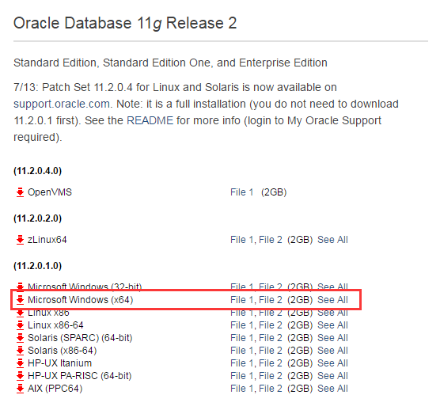

## 解压缩

- 下载完成之后会得到两个压缩文件，我们需要解压缩之后安装：选中两个压缩包，右键解压到当前文件夹

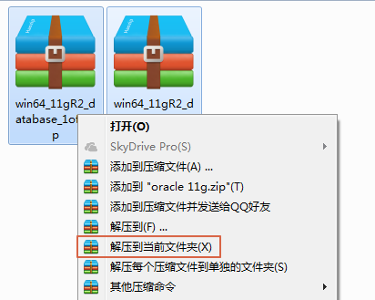

- 解压缩之后得到名为`database`的文件夹

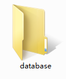

## 安装

- 双击`database`文件夹下的`setup.exe`文件，开始安装

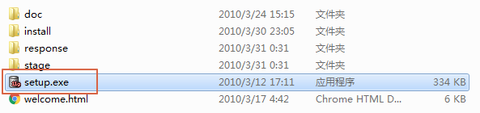

- 启动安装界面（此过程出现警告的话，可以直接忽略）

- 是否需要安全更新，把勾去掉，不需要，然后点击下一步

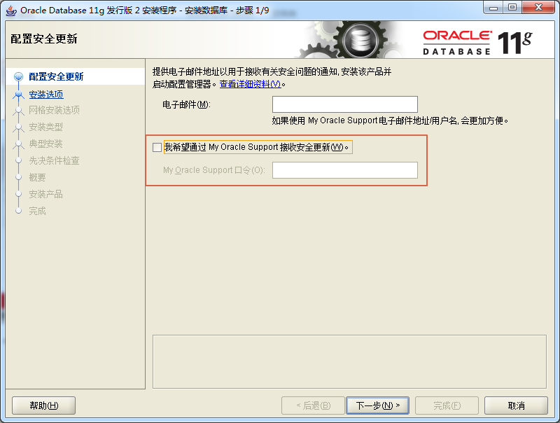

- 选择创建和配置数据库，因为我们上课需要测试数据，所以要配置数据库。然后点击下一步

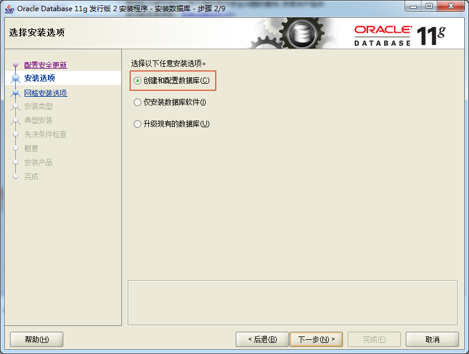

- 选择服务器类，还是因为我们要学习使用，服务器类功能更强大。然后点击下一步

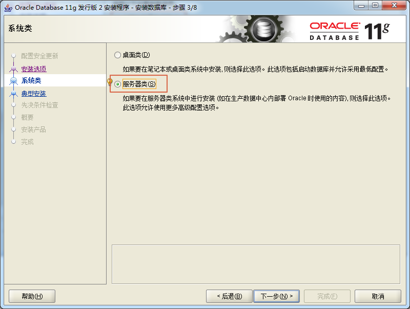

- 选择单实例数据库安装，一个实例足够我们教学使用。然后点击下一步

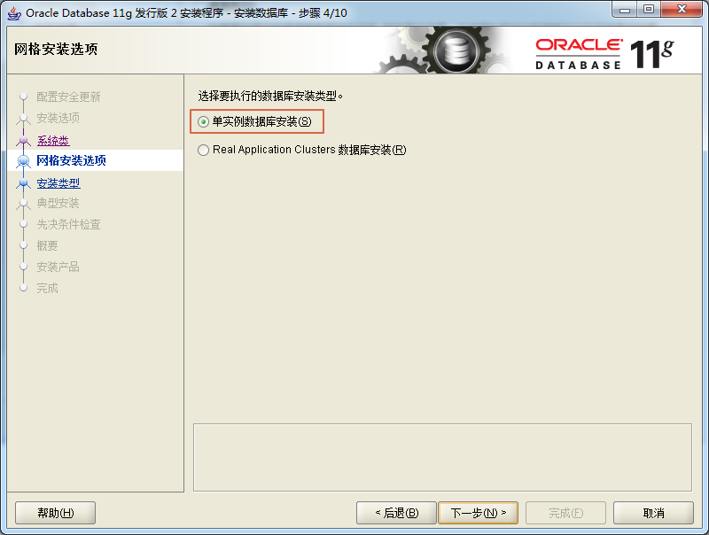

- 选择高级安装，因为我们需要自定义一些用户的口令、字符集等等。然后点击下一步

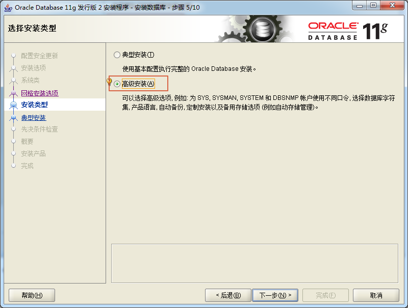

- 语言选择默认就好，不解释。然后点击下一步

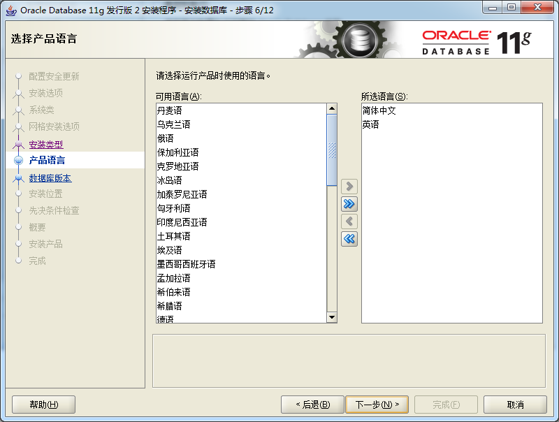

- 选择企业版，还是因为功能多。然后点击下一步

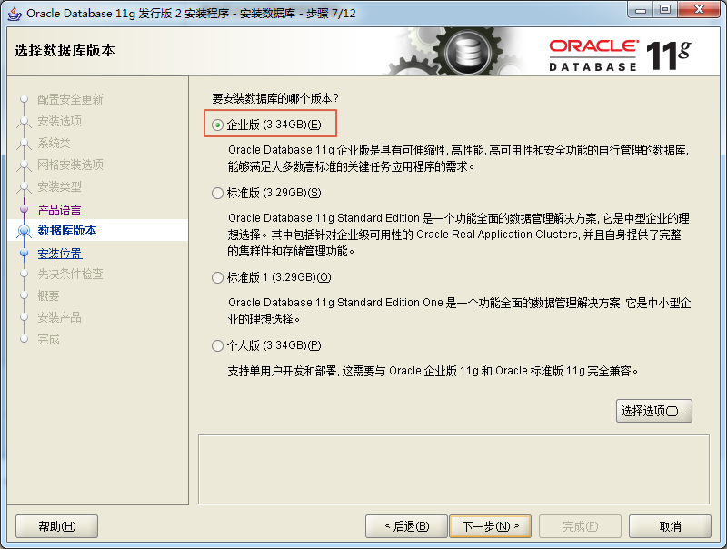

- 安装位置，最好选择一个空间稍大些的盘符来安装。然后点击下一步

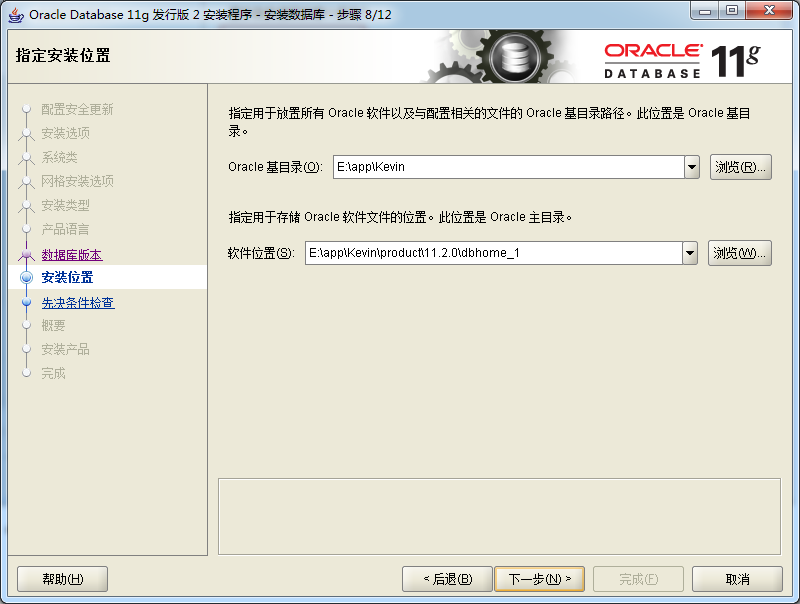

- 选择一般用途。然后点击下一步

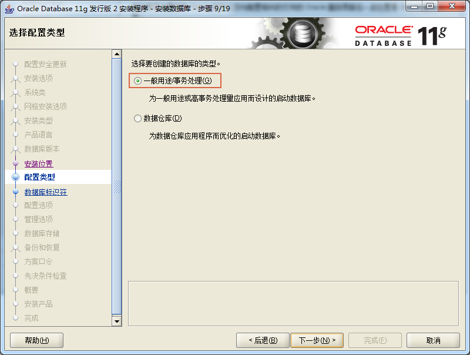

- 数据库名，也叫实例名，可以用默认的orcl，但是一定要记住，以后会用到。然后点击下一步

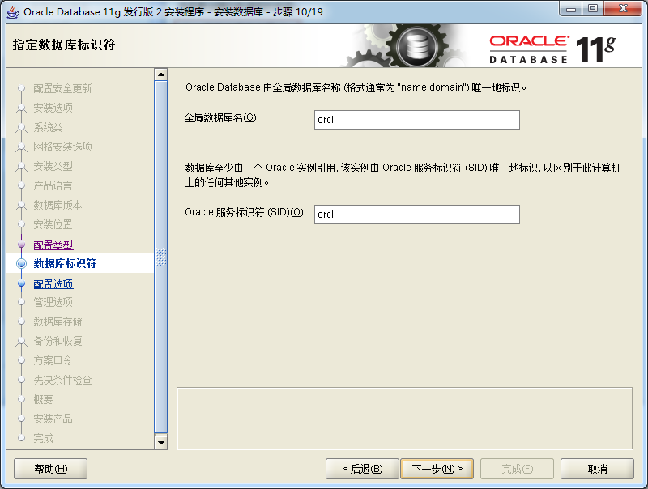

- 分配内存，根据自己电脑的配置分配合适的内存。不要点下一步，切换选项卡到字符集

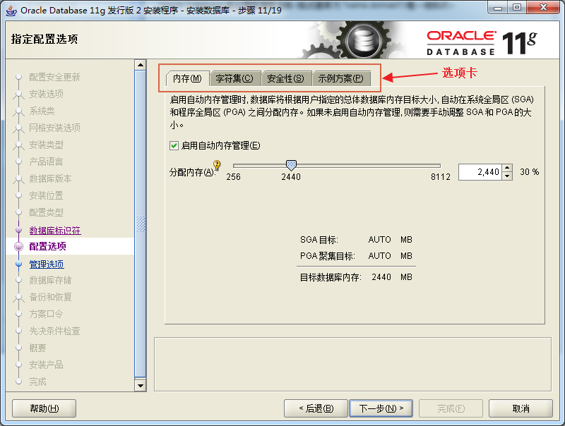

- 设置字符集为UTF-8。然后切换选项卡到实例方案

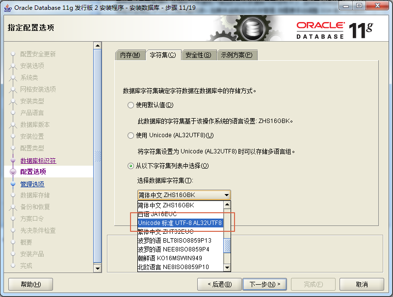

- 添加示例数据，方便上课使用。然后点击下一步

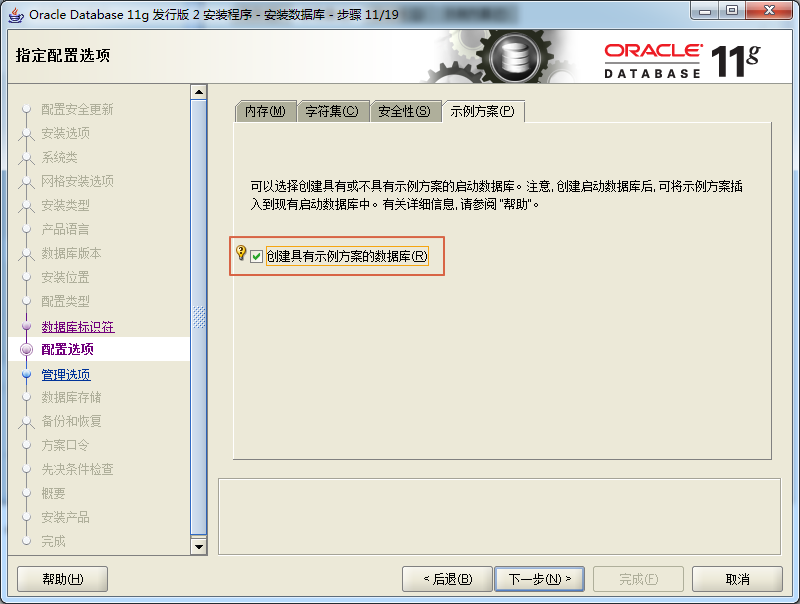

- 接下来一致默认，点击下一步。直到“指定方案口令”
- 指定方案口令，为了方便记忆，选择对所有账号使用相同的口令。由于是学习使用，所有口令没必要设置太复杂，设置一个自己不可能忘掉的口令，比如：123456。这里会提示口令不安全，忽略就好。然后点击下一步

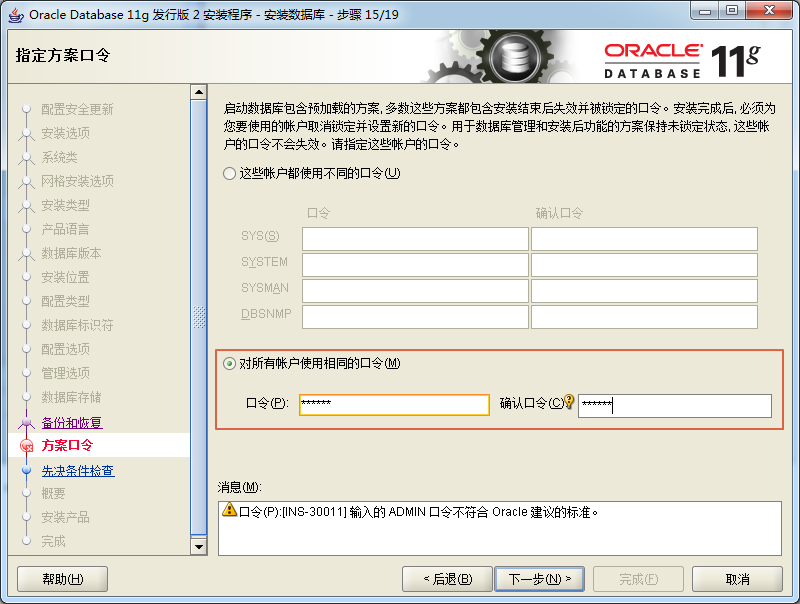

- 此时开始检查当前系统是否适合安装Oracle，下图说明可以安装，点击完成开始安装（如果出现警告，可以全部忽略）

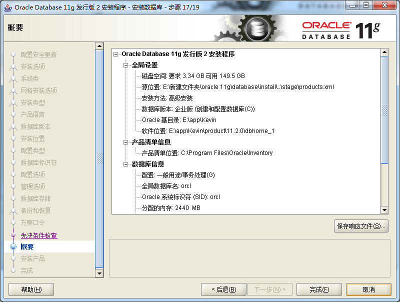

- 此时进入漫长的安装过程，只需要等待就好，中间如果有警告，全部忽略（不是错误就好）

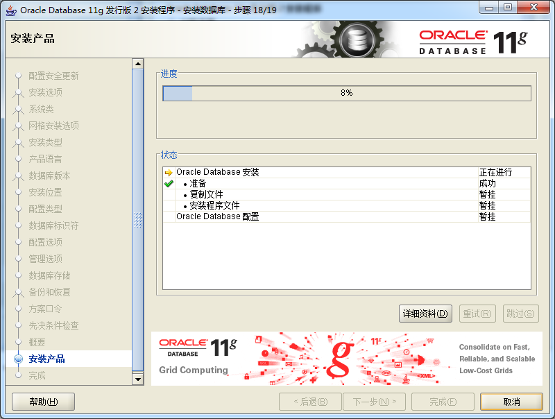

- 等待过程中会创建示例数据，继续等待

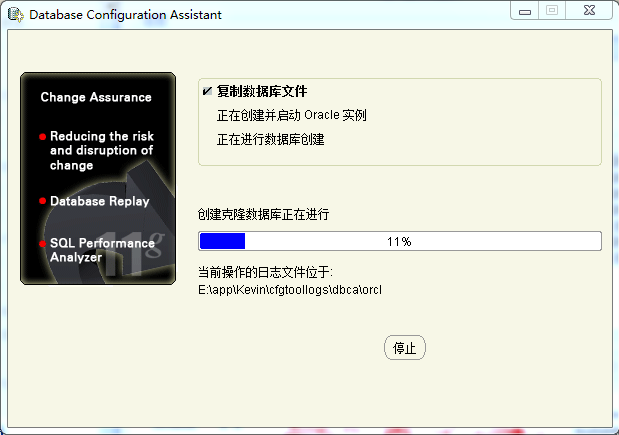

- 很重要的一步，在这个界面选择口令管理

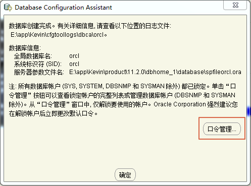

- 解锁hr用户，把勾去掉，设置新口令

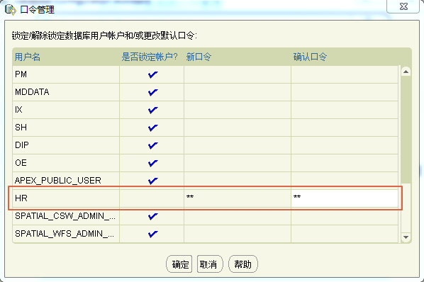

- 此时，已经安装完成

## 启动

安装成功之后，我们需要启动Oracle服务。

- 打开服务，`Win+R`输入`services.msc`

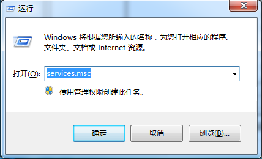

- 找到`OracleOraDb11g_home1TNSListener`,`OracleServiceORCL`，启动这两个服务

## 测试

- 启动`SQL Plus`，从安装目录找到SQL Plus

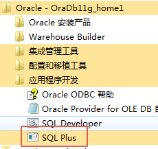

- 输入刚刚解锁的hr用户，口令也是hr，出现下图说明成功

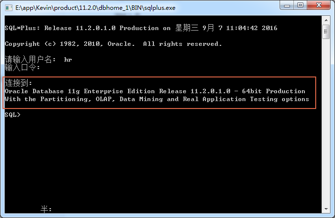

## 卸载（重新安装）

Oracle卸载成功之后不一定可以马上重新安装，所以轻易不要卸载。卸载的话分为以下两种情况：

- 安装成功后卸载
- 安装失败后卸载

### 安装成功

1. 使用Oracle自带的卸载程序进行卸载，在开始菜单里选择`Universal Installer`

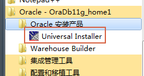

2. 进入安全模式
3. 打开注册表编辑器，搜索oracle，把和Oracle有关的注册表项全部删除
4. 然后重新进入系统重新安装

### 安装失败

1. 进入系统安全模式
2. 删除所有安装文件
3. 打开注册表编辑器，搜索oracle，把和Oracle有关的注册表项全部删除
4. 然后进入系统重新安装

### 终极大招

**重装系统！！！**