# SQL简单查询

[TOC]

## 概述

> 所谓简单查询，值的就是查询一张数据表中的所有行内容。其使用的语法格式如下：

```sql
SELECT [DISTINCT] * | 列名 [别名] ,...
FROM 表名;
```

- 执行上述语句，会先执行`FROM`语句，后执行`SELECT`语句。
- `FROM`语句确定数据源，`SELECT`语句确定要查询的内容。
- 如果要查询全部列，不需要把全部列名写全，可以使用通配符`*`

## 例子

### 查询全部列

```sql
SELECT * FROM employees;
```

​	查询结果：

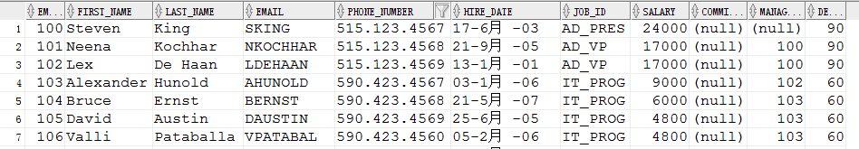

### 查询指定的列

**例子：**查询每个雇员的编号，姓名，职位，工资。

```sql
SELECT employee_id,last_name,job_id,salary FROM employees;
```

​	查询结果：

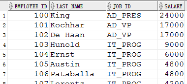

**例子：**查询所有的职位信息

```sql
SELECT job_id FROM employees;
```

​	查询结果：

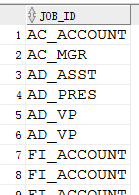

## 去重复行

### DISTINCT关键字

​	观察上述结果可以发现，已经显示出了所有的职位信息，但是出现了重复数据

### 例子

查询所有的职位信息，去重复项

```sql
SELECT DISTINCT job_id FROM employees;
```

​	查询结果：

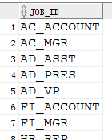

​	观察查询结果可以发现，已经显示出了所有的职位信息，而且去除了重复数据

**例子：**查询每个雇员的编号，姓名，薪资，年薪

```sql
SELECT employee_id,last_name,salary,salary*12 FROM employees;
```

​	查询结果

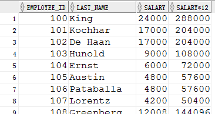

​	此时我们发现，已经查询到了我们需要的内容，但是最后一列的列名好像有点奇怪，我们最好修改一下

## 列别名

### 特点和功能

- 重命名列标题
- 有助于计算

### 例子

#### 简单列别名

```sql
SELECT employee_id,last_name,salary,salary*12 income FROM employees;
```

​	查询结果

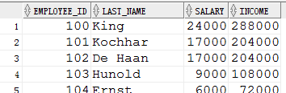

#### 使用双引号

```sql
SELECT employee_id,last_name,salary,salary*12 AS "Annual Salary" FROM employees;
```

​	查询结果

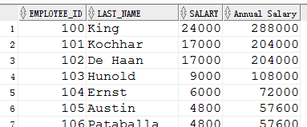

### 注意

1. 紧跟在列名的后面（可以在列名和列别名之间加`AS`关键字）
2. 如果列别名包含特殊字符、空格或大小写，则需要使用双引号`""`

## 算术表达式和空值

### 算术表达式

- 使用算数运算符，可以创建数字和日期数据表达式

```sql
SELECT last_name, salary, salary + 300 FROM employees;
```

​	查询结果

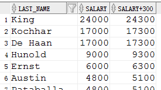

- 混合运算

```sql
SELECT last_name,salary,salary*12+100 FROM employees;
```

​	查询结果


### 空值

- 空值是指不可用、未分配、未知或不适用的值.
- 空值不同于零和空格. 

在雇员表中，提成字段会有空值

```sql
SELECT last_name, job_id, salary, commission_pct FROM employees;
```

​	查询结果

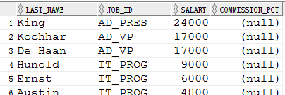

- 空值参与任何运算得到的结果，仍是空值

```sql
SELECT last_name, 12*salary*commission_pct FROM employees;
```
​	查询结果

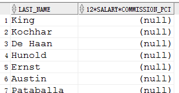

## 连接运算符

### 特点和功能

1. 将列和字符串连接到其他列
2. 由两条竖线`||`表示
3. 创建一个合并列，是字符表达式

### 注意

1. 文字是指 SELECT 列表中的字符、数字和日期.
2. 日期和字符文字必须包含在单引号中.
3. 在输出结果中，每个返回行都会将每个字符串显示一次.

### 例子

#### 简单连接

```sql
SELECT	last_name||job_id AS "Employees" FROM 	employees;
```

​	查询结果

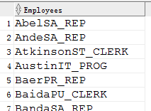

#### 文本字符串

```sql
SELECT last_name ||' is a '||job_id AS "Employee Details" FROM employees;
```

​	查询结果

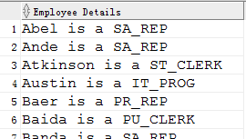

#### 引用定界符（q）

```sql
SELECT department_name
  || q'[ Department's Manager Id: ]'
  || manager_id AS "Department and Manager"
FROM departments;
```

​	查询结果

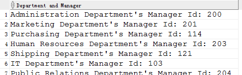


## 总结

1. 简单查询就是查询全部的数据行，但是由SELECT语句控制数据列
2. 使用DISTINCT去除重复项
3. 列别名的使用
4. 算数运算符和空值
5. 使用连接运算符连接字符串或字段